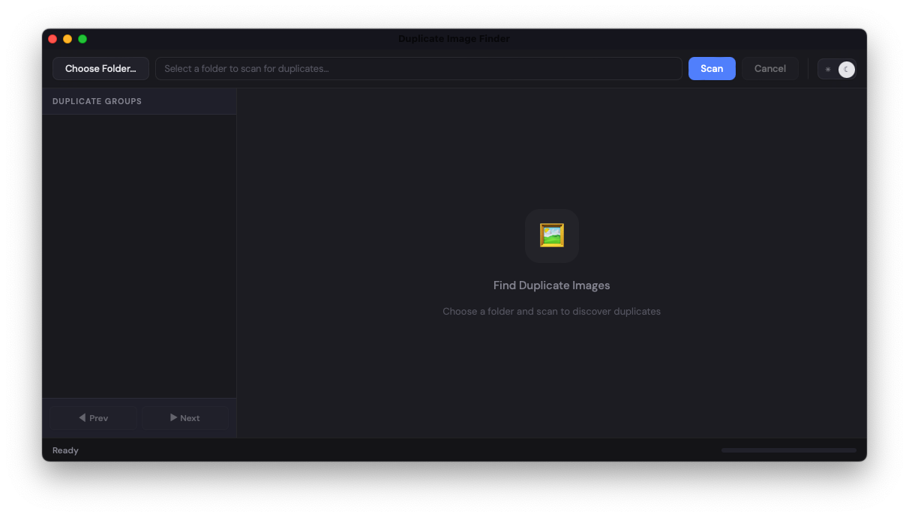
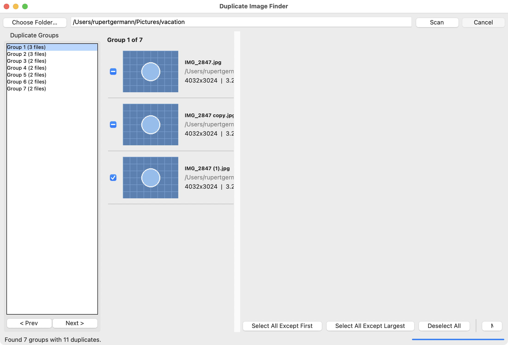

# Duplicate Image Finder

A native macOS desktop application for finding and managing duplicate images, built with Tauri v2 (Rust backend, HTML/CSS/JS frontend).

   

## Screenshots

### Welcome Screen


### Duplicate Groups View


## Features

- **Fast parallel MD5 hashing** -- uses [rayon](https://crates.io/crates/rayon) for multithreaded hash computation across all CPU cores
- **Recursive folder scanning** -- walks the entire directory tree, following symlinks
- **Thumbnail preview** -- generates 250x250 thumbnails for side-by-side comparison
- **File details** -- dimensions, file size, and modification date for each image
- **Safe deletion** -- move files to trash (recoverable) or delete permanently, with confirmation dialogs
- **Smart selection helpers** -- bulk-select duplicates while keeping the first or largest file
- **Open file** -- open an image in your default viewer
- **Reveal in Folder** -- show the file in Finder
- **Group navigation** -- browse duplicate groups in a sidebar with prev/next controls
- **Cancel anytime** -- long scans can be cancelled mid-progress
- **Standalone native app** -- produces a ~12 MB macOS `.app` bundle with no runtime dependencies

## Supported Image Formats

JPG, JPEG, PNG, GIF, BMP, TIFF, TIF, WebP, HEIC, HEIF, AVIF, ICO

## Prerequisites

- [Rust toolchain](https://rustup.rs/) (stable)
- [Node.js](https://nodejs.org/) and npm

## Getting Started

```bash
# Clone this repository
git clone https://github.com/yourusername/duplicate-image-finder.git
cd duplicate-image-finder

# Install frontend dependencies
npm install

# Run in development mode (hot-reload)
npx tauri dev
```

## Building

```bash
npx tauri build
```

This build produces the release executable at:

```
src-tauri/target/release/duplicate-finder
```

To build a macOS `.app` bundle, run:

```bash
npx tauri build --bundles app
```

The app bundle is then created at:

```
src-tauri/target/release/bundle/macos/DuplicateImageFinder.app
```

## Usage

1. Click **Choose Folder** and select a directory to scan
2. Click **Scan** -- the app recursively finds all images and groups exact duplicates by MD5 hash
3. Browse duplicate groups in the left panel
4. For each group, review the thumbnails, file paths, sizes, and dates
5. Use the selection helpers:
   - **Select All Except First** -- keeps the first file, selects the rest
   - **Select All Except Largest** -- keeps the largest copy
   - **Deselect All** -- clear selection
6. Choose an action:
   - **Move to Trash** -- safe, recoverable via macOS Trash
   - **Delete Permanently** -- irreversible, requires extra confirmation
7. The group auto-updates or disappears once duplicates are resolved

## Tech Stack

| Component | Technology |
|-----------|------------|
| Backend | Rust (Tauri v2) |
| Frontend | HTML / CSS / vanilla JavaScript |
| Hashing | MD5 with parallel processing ([rayon](https://crates.io/crates/rayon)) |
| File walking | [walkdir](https://crates.io/crates/walkdir) |
| Image processing | [image](https://crates.io/crates/image) (thumbnails, dimensions) |
| Trash support | [trash](https://crates.io/crates/trash) |
| IPC | Tauri command system (Rust <-> JS) |

## Project Structure

```
duplicate-image-finder/
├── src/
│   └── index.html           # Frontend (UI + JS logic, single file)
├── src-tauri/
│   ├── Cargo.toml            # Rust dependencies
│   ├── tauri.conf.json        # Tauri configuration
│   ├── src/
│   │   ├── lib.rs             # Core logic (scanning, hashing, file ops)
│   │   └── main.rs            # Entry point
│   └── target/                # Build output
├── package.json               # Node.js / Tauri CLI config
├── screenshots/               # App screenshots
├── LICENSE                    # MIT License
└── README.md
```

## License

[MIT](LICENSE)
